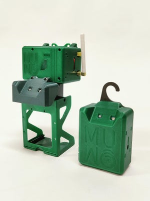
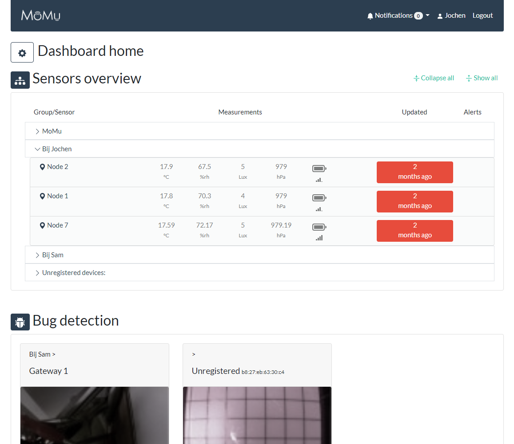
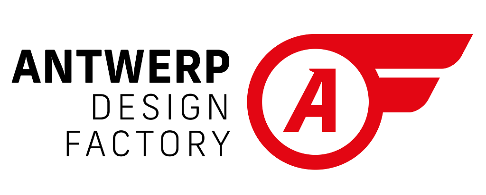

# MuMo
The MuMo project is an attempt to make an open source easy to setup platform to monitor environmental conditions of multiple sensors using IOT Lora modules and off the shelf hardware. 

MuMo stands for 'Museum Monitoring' and refers to the initial founder and prototype developer of the project, which is the fashion museum in Antwerp (named MoMu). MuMo is developed in collaboration with the University of Antwerp - Department of Product Development. 

The project consists of 3 main parts. A sensor node design, a gateway that also houses various sensors and a dashboard to visualize all recorded measurements and to alert users of any out of bound values. 

 

### The sensor node 

The sensor node is built around a Lorawan Seeed board that contains a ATSAMD21 processor (arduino zero compatible) and a RHF76 Lora module. 

It features Seeed grove sensor connectors that can accommodate a series of sensors. In this project we chose a BME680 that records environment temperature, relative humidity and barometric pressure and a TSL2561 to measure visible light values (in lux). 

To power the unit for a long period of time, we use 6 rechargeable AA batteries that should give the node an operating cycle of around two years (depending on the frequency of measurements sent). 

All in a 3D printer optimized housing and programmable without special tools. 

The code features: 

- The Things Network connection 
- Measurement frequency from minutes to days 
- Intermittent measurements every minute to check for extreme conditions. 
- Immediate warning transmissions if any warnings are raised. 
- Down-linkable updates to all settings 
- Ability to connect other sensors by adding their library and implementation. 
- Decent power efficiency by using the internal RTC of the ATSAMD21 (down to 65 µA) 

### The Gateway 

Build around a Raspberry Pi and containing a Dragino lora concentrator, dust particle sensor, Grove sensor shield with environmental sensors connected and a bug detection camera. Most of these components are modular and optional, so that any useful combination of elements can be made. 

The inclusion of the Dragino Lora concentrator makes this unit a Lora gateway that receives all data from the nodes and forwards the data to the things network through a WIFI connection or Ethernet. Using this board hundreds of nodes can be connected. 

Python code on the Pi records all measurements like is done on the Nodes themselves. But in this case also utilizes the power consuming VOC measurements of the BME680 and an extra dust particle sensor (also power consuming that would not be desirable in the battery powered nodes). 

A night vision camera can be placed in various locations around the unit to record bug traps. It provides a daily updated picture that can give a history log of events that occurred.  

This unit also features a 3D printer optimized housing and is programmable without specialist tools. 

#### Ready made alternative Gateway (TTN indoor gateway)
If you are just interested in the functionalities of the sensor nodes and dashboard, there is an easier alternative Gateway solution. You can order a The Things Indoor Gateway and activate this ready-made gateway in less that 5 minutes. You can find more information [on the site of TTN](https://www.thethingsnetwork.org/docs/gateways/thethingsindoor/index.html).
 

### The Dashboard 

The dashboard visualizes the data received by The Things Network. It shows the latest measurements captured by the sensors from the nodes and gateway in one application. And shows graph of all recorded measurements up to date. It gives a manageable overview to setup alerts for any out of bound recordings and can be integrated in other platforms (if desired). On top of this, the calibration of the sensors and user access is managed with this dashboard. 

Requirements: 

- PHP version 5.6 or greater. 
- MYSQL version 5.6 or greater or MariaDB version 10.1 or greater. 
- Online accessible url (may be a subdomain as well) 

## Open source 

All the development done for this project is open to be used, modified and shared if credits are given.  

In this github you can find:  
- Shopping lists for all parts that we used. 
- .Stl files to print any of the housings. 
- Codes for the nodes, gateways and dashboard. 
- Manuals to take you through the assembly step by step. 

# Where to find all parts:
- [Shopping list for the project.](/Shopping_list.md)
---
### Node
- [Step by step assembly manual of the Node.](/Node/readme.md)
- [STL files to 3D print the Node housing.](/Node/STL_NODE)
- [Latest Arduino code of the Node.](/Node/mumoV1)
---
### Gateway / extensions
- [Step by step assembly manual of the Gateway.](/Gateway/readme.md)
- [STL files to 3D print the Gateway housing / extensions.](/Gateway/STL_GATEWAY)
---
### Dashboard
- [Step by step installation of the online dashboard.](/Dashboard/readme.md)
- [All required files can be found in the same folder.](/Dashboard)

# Contributions

The MuMo project is a collaboration between [MoMu](https://www.momu.be/en/) and the [University of Antwerp](https://www.uantwerpen.be/nl/studeren/aanbod/alle-opleidingen/productontwikkeling-studeren/) - [Antwerp design factory](https://www.uantwerpen.be/nl/projecten/mondmaskers/over-ons/antwerp-design-factory/).

Funded by the Flemish Government [Innovatief  partnerproject](https://www.vlaanderen.be/cjm/nl/cultuur/cultuur-en-economie/innovatieve-partnerprojecten) under the name: Developing a IOT Datalogger for Museums using LoRaWan

   
